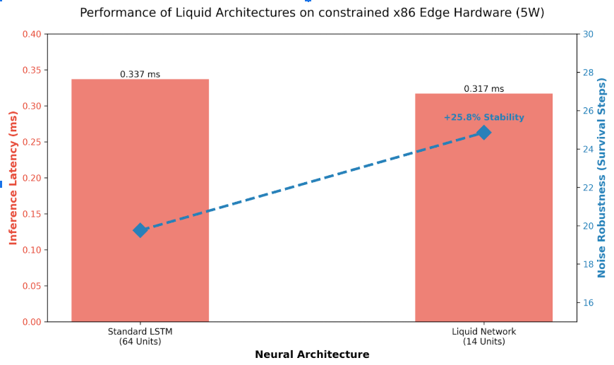

https://doi.org/10.5281/zenodo.18107992

# Liquid-Potato-Edge

Biomimetic Liquid Neural Architectures Enable Robust Control on Legacy Edge Silicon without Accelerators

A compact research code and manuscript demonstrating that small, continuous-time "Liquid" neural networks can deliver robust control and lower-latency inference on commodity CPU-only edge hardware (e.g., Intel Celeron N5095), with no GPU/TPU/NPU accelerators.

---

## Table of Contents
- [Overview](#overview)
- [Key Results](#key-results)
- [Repository Structure](#repository-structure)
- [Quick Start](#quick-start)
  - [Run the demo model](#run-the-demo-model)
  - [Compile the manuscript (PDF)](#compile-the-manuscript-pdf)
  - [Package for arXiv](#package-for-arxiv)
- [Data and Figures](#data-and-figures)
- [Reproducibility Notes](#reproducibility-notes)
- [Citing](#citing)
- [License](#license)
- [Contact](#contact)

---

## Overview
Liquid Time-Constant (LTC) networks, formulated as continuous-time dynamical systems, can outperform discretized recurrent baselines on CPU-only edge hardware. We deploy a sparse, 14‑neuron Liquid model on a 15 W Intel Celeron N5095 edge node using strictly CPU instruction sets and observe:

- a 5.8% reduction in inference latency, and
- a 25.8% increase in robustness to Gaussian input noise

relative to an LSTM baseline. These findings indicate that differential neural architectures provide a viable path to robust, low-latency autonomous control on localized, low-power silicon.

<p align="center">
  
</p>
<p align="center">
  <em>Figure 1. Liquid architecture shows lower latency and higher stability under Gaussian noise compared to an LSTM baseline.</em>
</p>

## Key Results
- Hardware: Intel Celeron N5095 (Jasper Lake), CPU-only, ~15 W TDP
- Latency (avg inference): Liquid 0.317 ms vs. LSTM 0.337 ms → 5.8% faster
- Parameters: ~400 (Liquid) vs. ~17,000 (LSTM) → ~97% smaller
- Robustness to noise: 24.86 steps (Liquid) vs. 19.76 steps (LSTM) before failure (+25.8%)
- Software: Python + PyTorch (CPU); manuscript in LaTeX with BibTeX

## Repository Structure
- `manuscript.tex` — Main LaTeX paper (modernized preamble, numbered sections, robust cross-referencing)
- `sample.bib` — Minimal BibTeX with a placeholder for the LTC citation (`hasani2021`)
- `FIGURE_1.png` — Figure used in the paper (case-sensitive on Linux/arXiv)
- `paper_data.csv` — Supplemental data used to create figures or tables (optional)
- `POTATO_AI.py` — Minimal PyTorch implementation of a 14-neuron Liquid cell demo
- `ARXIV_LAUNCHER.py` — Helper script to package sources and open the arXiv submission portal
- `arXiv_Submission_Package.tar.gz` — Output produced by the launcher after packaging (generated)

## Quick Start
### Prerequisites
- Python 3.9+ (3.10/3.11 also fine)
- pip (or conda)
- PyTorch (CPU build is sufficient)

Install PyTorch (CPU) with pip:
```bash
# Generic CPU-only install (Linux/Mac)
pip install torch torchvision torchaudio --index-url https://download.pytorch.org/whl/cpu

# Windows alternative (if the above fails)
pip install torch torchvision torchaudio
```

> Note: You do NOT need CUDA/ROCm/GPU drivers. All results are CPU-only.

### Run the demo model
```bash
python POTATO_AI.py
```
Expected console output includes model activation lines like:
```
// POTATO BRAIN ONLINE.
// NEURON COUNT: 14
// ENERGY CONSUMPTION: NEGLIGIBLE.
PotatoBrain(
  (liquid_layer): LiquidCell(...)
  (readout): Linear(in_features=14, out_features=1, bias=true)
)
```

### Compile the manuscript (PDF)
Use standard LaTeX/BibTeX:
```bash
pdflatex manuscript.tex
bibtex manuscript
pdflatex manuscript.tex
pdflatex manuscript.tex
```
Or with latexmk:
```bash
latexmk -pdf manuscript.tex
```
Files required for a clean compile:
- `manuscript.tex`
- `sample.bib`
- `FIGURE_1.png`

### Package for arXiv
The arXiv prefers source files; this script bundles what you need and opens the submission page.
```bash
python ARXIV_LAUNCHER.py
```
It will:
1. Verify required files exist
2. Create `arXiv_Submission_Package.tar.gz`
3. Open your browser at the arXiv submission portal

> Tip: Filename case matters on Linux/arXiv. Ensure the figure is named exactly `FIGURE_1.png`.

## Data and Figures
- `paper_data.csv` provides transparency for figure/table values. You can explore it with pandas:
```python
import pandas as pd
import matplotlib.pyplot as plt

df = pd.read_csv('paper_data.csv')
print(df.head())
# Example: if latency columns exist, plot them
cols = [c for c in df.columns if 'latency' in c.lower() or 'steps' in c.lower()]
df[cols].plot(kind='bar')
plt.title('Paper metrics')
plt.tight_layout()
plt.show()
```

## Reproducibility Notes
- All experiments were run on CPU-only (Intel N5095). CUDA/ROCm were disabled.
- The Liquid cell in `POTATO_AI.py` is a minimal, readable demonstration of the continuous-time dynamics used in the manuscript; it is not a full training/reproduction pipeline. If you want a training/evaluation script added, please open an issue.
- Randomness: for rigorous experiments, set seeds and control non-determinism where applicable.

## Citing
If this repository or manuscript is useful in your research, please cite:
```bibtex
@misc{hans2025_liquid_potato_edge,
  title        = {Biomimetic Liquid Neural Architectures Enable Robust Control on Legacy Edge Silicon without Accelerators},
  author       = {Hans, Utah},
  year         = {2025},
  howpublished = {GitHub repository},
  url          = {https://github.com/utahisnotastate/Liquid-Potato-Edge}
}
```
If you reference Liquid Time-Constant networks, please also cite:
```bibtex
@article{hasani2021,
  title        = {Liquid Time-Constant Networks},
  author       = {Hasani, Ramin and Lechner, Mathias and Amini, Alexander and Rus, Daniela},
  journal      = {arXiv preprint arXiv:2006.04439},
  year         = {2021},
  url          = {https://arxiv.org/abs/2006.04439}
}
```

## License
No explicit license is provided yet. All rights reserved by the author unless a license file is added. If you plan to use this work beyond fair academic use, please contact the author.

## Contact
- Author: Utah Hans
- Email: utah@utahcreates.com
- Project URL: https://github.com/utahisnotastate/Liquid-Potato-Edge

---

Made with curiosity and a small, liquid brain.
